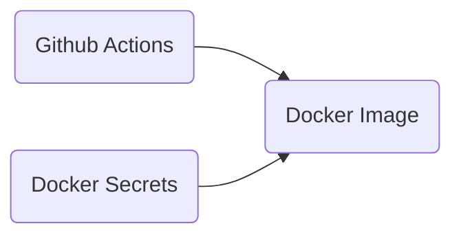
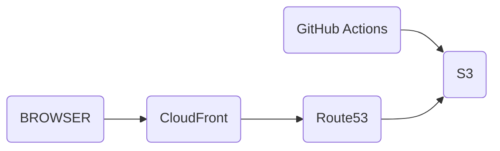

# geekyflamingo-fiesta
Fun with IaC

## Problem Statement

Convert a legacy codebase with embedded plaintext secrets into a more secure codebase.

## Context

The original repo had the secrets in plaintext. These secrets were included with the docker image as part of the administration of the web server.

## Assumptions

* Simple HTML Web Page == Static HTML Web Page
* AWS based Solution
  * Sticky/Vendor Lock in due to efficiency of solution

## Solutions

### Option 1

Docker Secrets used with github actions to remove secrets from repo

* Quick
* low lift
* Not coded but manual process - human errors possible

### Option 2

Remove secrets via S3 site hosting

* secrets managed via IAM vs basic auth
* Low lift
* Moderately scalable - due to leveraging Cloud services (S3, CloudFront, Route53)
* Highly Available
* Only Static HTML Pages allowed

### Option 2+

For minimally interactive web page

* Base from Option 2
* add Lambda cloud functions that can handle basic interactivity

### Option 3 - If Static Page Assumption is Wrong

If there is a large amount of interactivity on the HTML Page

* E*S - either ECS or EKS - depending on needs with EC2 or Fargate
* Still allows for IAM based credential management
* More complex, requires more mechanisms for managing
* Highly Scalable - EKS can be multi-region or even multi-cloud via cross cloud k8s clusters
* Highly Available - Ditto

For this learning focusing on Options 1 and 2. The final option is for discussion

## Architecture

### Option 1 - Github Actions

### Option 2 - S3 hosting

